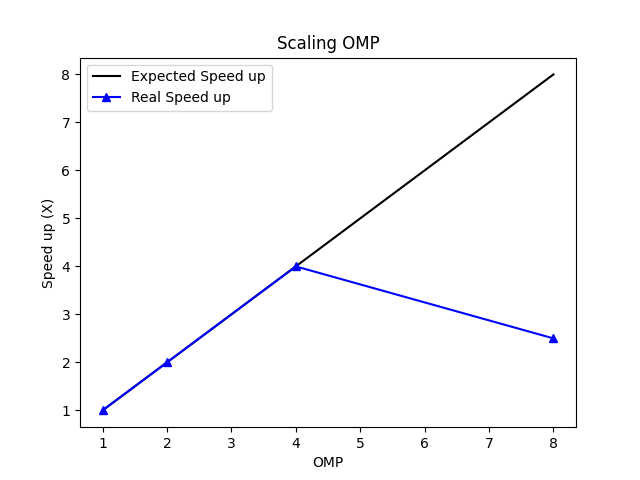

# Scalability plotting

Script for parse output performance results and generate plots.

## Usage

This script contains a command line user interface (main.py) but can also be loaded as a Python module.

There are several supported file types:

* txt: Plain text with `#` as comments and `$` for defining the field names.
* csv: Must have the first row with the column names. (WIP)

Once you read the file, you can compute **efficiency** and **scalability** by any field name of the input file. 
The results can be stored as png images, be written to a file or displayed in a GUI.

## External libraries
This script uses matplotlib.pyplot for plotting